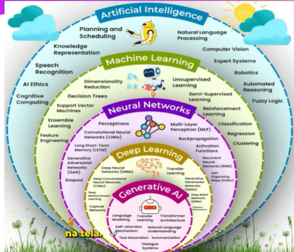
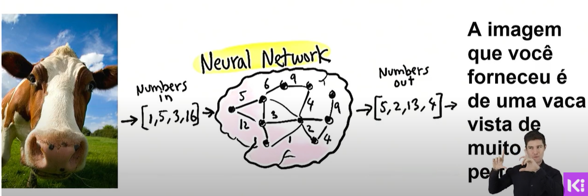
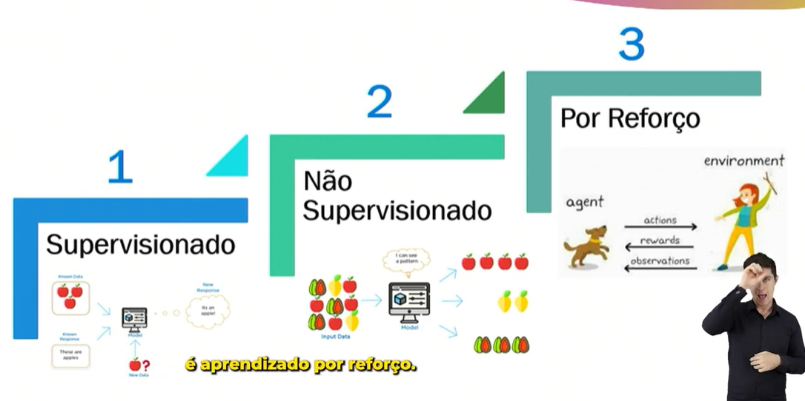
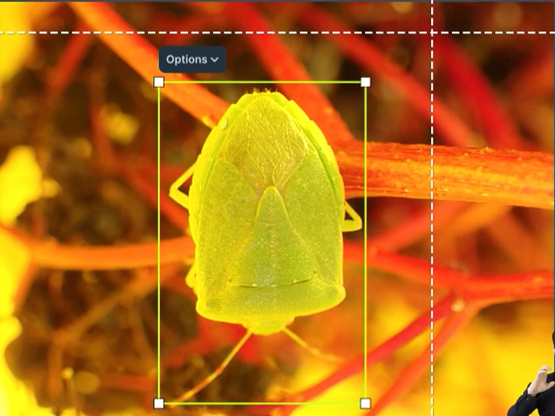

## Introdução à IA 

Inteligência artificial refere - se ao desenvolvimento des disteams de computador que podem executar tarefas que normalmente exigem inteligência humana.

- aprender com a experiência (aprendizado de maquina)
- entender a linguagem natural
- reconhecer padrões (reconhecer cachorro, gato, carro, etc)
- resolver problemas
- adaptar às situações de mudança

| técnica | O que a IA faz | exemplo |
| --------|----------------|---------|
| Aprendizado de maquina | Ensina a Ia com dados | Sugestões de filmes no youtube |
|Redes neurais | simula o cerebro humano | chatgpt entendendo perguntas |
| deep learning | IA com redes neurais profrundas | IA que cria imagens |
| NLP | Entende a linguagem humana | Google tradutor e Chatgpt |
| Visao computacional | Faz a IA "ver"| Camera que reconhece rostos |
| Sistemas especialistas | Toma decisões com base em regras | Diagnostico medico automatizado |
| Raciocinio/logica | Deduz informações logicamente | Assistente virtual tomando decisões |
| Robotica | Aplica IA em robos fisicos | Robo aspirador e robo de fabrica |

O curso irá focar mais na parte do generative AI

### onde encontramos inteligencia artificial?

- **e-commerce** (shoppe, mercado livre) - oferencendo produtos que se adequem ao seu perfil
- chatboots tipo **chatgpt**
- **assistentes virtuais** (siri, google assistente, meta AI, alexa) geralmete trabalham com linguagem natural
- **semafaros inteligentes**

### exemplo de como os computadores aprendem

A imagem que você forneceu é de uma vaca vista de muito perto

você coloca a foto como entrada -> a rede neural processa -> a saída pode ser um texto, um audio, etc

existem 3 tipos de aprendizado: supervisonado, nao supervisonado e por reforço

-**aprendizado supervisonado** quando você acompanha o computador no aprendizado dele 

exemplo: para que o computador reconheça o que é um percevejo você precisa ajudar o computador a entender sobre o que ele deve aprender  

